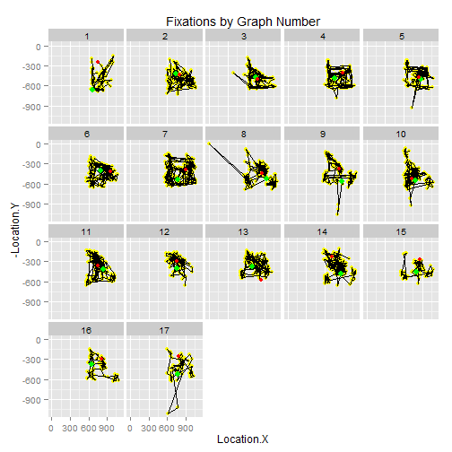

The Statistical Eye: Patterns in visual inferences
--------------------------------------------------
  Omesh Johar
--------------------------------------------------
  STAT 585X Project Report, Spring 2014
--------------------------------------------------
  
  Visual statistical inference is a way to determine significance of patterns found while exploring data (Majumder, Hofmann, & Cook, 2013a). Often, our inferences can be incorrect because of the way in which data are visualized. When in doubt about the prevalence of data misrepresentation, a simple google search for "misleading graphs" could be informative. The following two plots show how the choice of axis limits can mislead the audience. Data used to generate these two plots were made up for illustration purposes.

```r
library(plyr)
library(ggplot2)
library(plumbr)
library(ggvis)
```

```
## The ggvis API is currently rapidly evolving. We strongly recommend that you do not rely on this for production, but feel free to explore. If you encounter a clear bug, please file a minimal reproducible example at https://github.com/rstudio/ggvis/issues.For questions and other discussion, please use https://groups.google.com/group/ggvis.
## 
## Attaching package: 'ggvis'
## 
## The following objects are masked from 'package:ggplot2':
## 
##     guide_legend, layer, opts
## 
## The following objects are masked from 'package:base':
## 
##     pipe, scale, transform
```

```r
require(MASS)
```

```
## Loading required package: MASS
```

```r
library(jpeg)
library(grid)
library(grDevices)
library(png)
```


```r

## Set the outer margins so that bottom, left, and right are 0 and top is 3
## lines of text.

old.par <- par(no.readonly = TRUE)
par(oma = c(0, 0, 3, 0))

## Plot using layout().

nf <- layout(matrix(c(1, 2), 1, 2, byrow = TRUE), c(1, 1), c(1, 1), TRUE)
# layout.show( nf )

## Create the two plots.
graph <- data.frame(x = c("Aug", "Sept", "Oct"), y = c(5.5, 5.6, 5.7))
barplot(graph$y, ylab = "Unemployment", ylim = c(5.45, 5.75), main = "Alarming Rise?", 
    xpd = FALSE, names.arg = graph$x)
barplot(graph$y, ylim = c(0, 6), main = "Not really", xpd = FALSE, names.arg = graph$x)

## Create an overall title.

mtext(expression(bold("Visualizations of Unemployment Rate")), outer = TRUE)
```

 

```r

## Restore the old plotting parameters.

par(old.par)
```


Of course, grossly incorrect inferences should be prevented by training people to glance at the axes before drawing inferences. In order to establish the effectiveness of any such training, tracking eye-movements can be tremendously useful. 

Unfortunately, experience in data analysis might not completely immune people from drawing incorrect inferences. This is because misleading visualization is not the only source of incorrect inferences. Researchers and statisticians often deal with strained cognitive resources or high perceptual load. High load can even impair the ability to detect the presence of visual stimuli (Macdonald & Lavie, 2008). It is plausible that visual inferences drawn under such limiting conditions should be fallible.

In general, it remains difficult to assess the validity of visual inferences that people make. Past research does not offer a complete understanding of how people make visual inferences in the first place. Whereas high rejection rates of submitted manuscripts suggest that the scientific community is quick to point out _incorrect_ inferences drawn by fellow researchers, it is needed to empirically assess inferences drawn from visualizations of data.


**Current Research**
  
  This project is an attempt to explore ways in which visual inferences are drawn. Let us do a quick exercise to illustrate the kinds of questions that are relevant to this project. Please take a moment to examine the next plot. When you look at the plot, try to determine the slope of the line.


```r
file <- "C://Users//omesh//Dropbox//Omesh-CC//eye-tracker//stimuli//images//1png.png"

f <- readPNG(file)

d <- data.frame(x = seq(from = -4, to = 4, by = 1), y = seq(from = -8, to = 8, 
    by = 2))
ggplot(d) + xlim(-4, 4) + ylim(-8, 8) + annotation_custom(rasterGrob(f, width = unit(1, 
    "npc"), height = unit(1, "npc")), -4, 4, -8, 8) + theme(panel.background = element_blank(), 
    axis.text.x = element_blank(), axis.text.y = element_blank(), axis.ticks = element_blank())
```

 


Hopefully, you came up with some number. Now, try to think about the process by which you arrived at this number. Which parts of the graph did you look at? Did you notice the axes? Did you look at the points? If so, which ones? What was the first thing you saw? Also, how much time did it take to determine the slope of the line?

Answering such questions is key to understand the process by which visual inferences are drawn. 
To move further along this goal, participants looked at scatter plots and boxplots. Their eye-movements were recorded using an eye-tracker. 

_Method_

In a pilot study, one participant (myself) looked at a total of seventeen graphs were shown to the single participant. Each graph was preceded by a statistical question (e.g., what is the strength of the association between these two variables)? It took me 25 minutes to look at all the graphs.

I designed a protocol for looking at the graphs. I tried to adhere to the protocol as much as possible. Essentially, the protocol involved fixating at the origin of the graph and scanning the x- and y- axes.

_Code and Results_

Eye-tracking data were obtained using the SMI software. Data are available in a complex format. The software SMI was used to export data into ".txt" files. Available data contain information about the x-y coordinates of fixations and saccades (both eyes) along with time-stamps. Fixations denote sustained gaze for extended periods of time. Saccades denote rapid movements of the eyes between two points. In order to conduct statistical analysis, data were slightly "cleaned".


```r

### This function helps to separate fixation and saccade data

cleanup <- function() {
    file <- file.choose()
    # file <-
    # 'C://Users//omesh//Dropbox//Omesh-CC//eye-tracker//data//zstat1//z585_P01_001
    # FIX.txt'
    
    ### Extract identifying information
    df <- read.csv(file, header = F)
    
    # Get column names for fixation data (from line 9) result of split needs to
    # be unlisted
    headf <- unlist(strsplit(as.character(df[9, ]), split = "\t"))
    headf[7] <- "Location.X"
    headf[8] <- "Location.Y"
    headf <- c("id", "graph", "event", "eye", headf[-1])
    
    # Get column names for saccade data (from line 11)
    heads <- unlist(strsplit(as.character(df[11, ]), split = "\t"))
    heads[7] <- "Slocx"
    heads[8] <- "slocy"
    heads[9] <- "elocx"
    heads[10] <- "elocy"
    heads <- c("id", "graph", "event", "eye", heads[-1])
    
    ### Next, I extracted all data
    df1 <- read.delim(file, sep = "\t", header = FALSE, skip = 17)
    head(df1)
    class(df1)
    
    
    # generate id for participant, graph for image seen, add them to the data
    id <- as.vector(rep(1, times = dim(df1)[1]))
    graph <- rep(1, times = dim(df1)[1])
    
    df1 <- cbind(id, graph, df1)
    
    ### Now we can remove rows containing names of graphs Find out which rows
    ### contains information about graphs Find the length of each region
    pos <- grep("UserEvent", df1[, 3])
    
    ### Note that the number of integers between x and y (including x) is y + 1 -
    ### x Shift the positions vector one space to the left and add one element add
    ### the end
    pos_shift <- pos[-1]
    pos_shift[length(pos_shift) + 1] <- dim(df1)[1] + 1
    
    ### Length of each region = number of rows = difference between pos and
    ### pos_shift
    reps <- pos_shift - pos
    
    ### Generate ids (1 - 17)
    ids <- seq(from = 1, to = length(pos), by = 1)
    ### Repeat the ids based on the length of each region
    gr <- c(rep(ids, times = reps))
    
    ### update ids in the data
    df1$graph <- gr
    
    ### Remove rows containing image data
    df1 <- df1[-pos, ]
    
    # Separate the third column to separate event from left/right eyes
    list <- strsplit(as.character(df1[, 3]), " ")
    
    # Transform the list into a data frame and set appropriate column names:
    v <- ldply(list)
    colnames(v) <- c("event", "eye")
    
    
    df1 <- cbind(df1[, 1:2], v, df1[, 4:dim(df1)[2]])
    # combine new first 2 columns with the rest of the data.frame df2 <- cbind (
    # id, v , df1 [,2:dim(df2)[2]])
    
    dfix <- subset(df1[, 1:16], event == "Fixation")
    names(dfix) <- headf
    
    dsac <- subset(df1, event == "Saccade")
    names(dsac) <- heads
    
    p <- list(dfix, dsac)
    names(p) <- c("fix", "sac")
    return(p)
}
```


```r

### This function helps to plot the fixation data
pfix <- function(df2) {
    ### Print fixation data (show temporal order, mark start/end points) To print
    ### the last fixation, extract coordinates for each graph df2 <- subset ( df1
    ### , Event.Type == 'Fixation L')
    l <- ddply(df2, .(graph), summarise, n = length(Number), x1 = Location.X[length(Number)], 
        y1 = Location.Y[length(Number)])
    
    ### Plot coordinates of fixation points y coordinates need to be inverted
    g <- ggplot(data = df2, aes(x = Location.X, y = -Location.Y)) + # mark points yellow
    geom_point(colour = "yellow") + # connect points in temporal order
    geom_path() + # Colour the first fixation point green
    geom_point(data = df2[df2$Number == 1, ], aes(x = Location.X, y = -Location.Y), 
        size = 3, colour = "green") + # Colour the last fixation point red
    geom_point(data = l, aes(x = x1, y = -y1), colour = "red") + # Separate plots for each graph
    facet_wrap(~graph) + # Main title
    ggtitle("Fixations by Graph Number")
    print(g)
}


t <- cleanup()
names(t)
```

```
## [1] "fix" "sac"
```

```r
pfix(t$fix)
```

 


**Discussion**

This project is a preliminary exercise in studying visual inferences. More involved analyses of eye-tracking data could potentially help to answer interesting questions about the process which which people make inferences from visual representations of data. 

_Future Directions_

Visual statistical inferences have been examined only by a few past studies. For instance, Majumder and colleagues (2013b) examined the performance of line-up based visual inferences. They found that line-up protocols outperform conventional tests when data are contaminated. An obvious questions then is, how robust are visual inferences? It would be interesting to subject visual inferences to cross-validation: are visual inferences affected by certain data points? Although one way to address this question is to conduct an experiment in which participants draw inferences from plots of subsets of a data set, this question can also be addressed in an eye-tracking study. For instance, if participants in a study did (or did not) fixate on a specific point on a graph then that point may (or may not) influence the resulting inferences.

**Conclusion**

It is fascinating that we can track peoples' eye-movements! Research has just begun to harness the potential of eye-tracking for studying visual statistical inferences. Eye-tracking definitely offers a lot of promise. However, lot of work still needs to be done.

_References_

Macdonald, J. S. P., & Lavie, N. (2008). Load induced blindness. _Journal of Experimental Psychology: Human Perception and Performance, 34(5),_ 1078-1091. 

Majumder, M., Hofmann, H., & Cook, D. (2013a). _Human Factors Influencing Visual Statistical Inference._ Unpublished manuscript, Iowa State University, Ames, IA.

Majumder, M., Hofmann, H., & Cook, D.(2013b). Validation of Visual Statistical Inference, Applied to Linear Models. _Journal of the American Statistical Association, 108_, 942-956.
