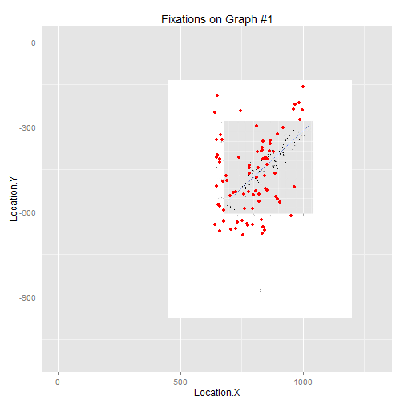
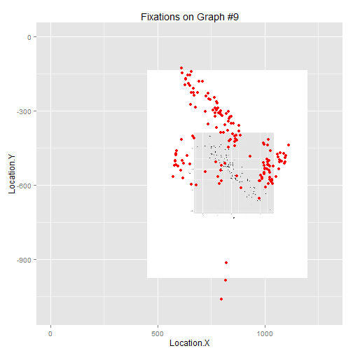
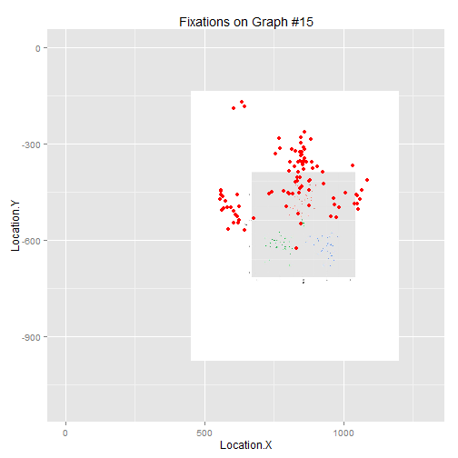
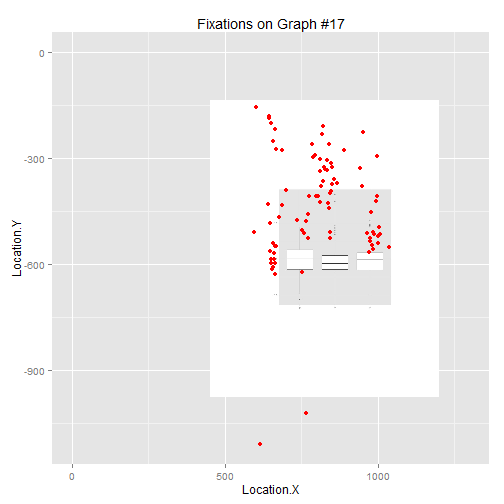

The Statistical Eye: Patterns in visual inferences
--------------------------------------------------
Omesh Johar
--------------------------------------------------
STAT 585X Project Report, Spring 2014
--------------------------------------------------

Visual statistical inference is a way to determine significance of patterns found while exploring data (Majumder, Hofmann, & Cook, 2013a). Often, our inferences can be incorrect because of the way in which data are visualized. When in doubt about the prevalence of data misrepresentation, a simple google search for "misleading graphs" could be informative. The following two plots show how the choice of axis limits can mislead the audience. Data used to generate these two plots were made up for illustration purposes.

```r
library(plyr)
library(ggplot2)
library(plumbr)
library(ggvis)
```

```
## The ggvis API is currently rapidly evolving. We strongly recommend that you do not rely on this for production, but feel free to explore. If you encounter a clear bug, please file a minimal reproducible example at https://github.com/rstudio/ggvis/issues.For questions and other discussion, please use https://groups.google.com/group/ggvis.
## 
## Attaching package: 'ggvis'
## 
## The following objects are masked from 'package:ggplot2':
## 
##     guide_legend, layer, opts
## 
## The following objects are masked from 'package:base':
## 
##     pipe, scale, transform
```

```r
require(MASS)
```

```
## Loading required package: MASS
```

```r
library(jpeg)
library(grid)
library(grDevices)
library(png)
```


```r

## Set the outer margins so that bottom, left, and right are 0 and top is 3
## lines of text.

old.par <- par(no.readonly = TRUE)
par(oma = c(0, 0, 3, 0))

## Plot using layout().

nf <- layout(matrix(c(1, 2), 1, 2, byrow = TRUE), c(1, 1), c(1, 1), TRUE)
# layout.show( nf )

## Create the two plots.
graph <- data.frame(x = c("Aug", "Sept", "Oct"), y = c(5.5, 5.6, 5.7))
barplot(graph$y, ylab = "Unemployment", ylim = c(5.45, 5.75), main = "Alarming Rise?", 
    xpd = FALSE, names.arg = graph$x)
barplot(graph$y, ylim = c(0, 6), main = "Not really", xpd = FALSE, names.arg = graph$x)

## Create an overall title.

mtext(expression(bold("Visualizations of Unemployment Rate")), outer = TRUE)
```

 

```r

## Restore the old plotting parameters.

par(old.par)
```


Of course, grossly incorrect inferences should be prevented by training people to glance at the axes before drawing inferences. In order to establish the effectiveness of any such training, tracking eye-movements can be tremendously useful. 

Unfortunately, experience in data analysis might not completely immune people from drawing incorrect inferences. This is because misleading visualization is not the only source of incorrect inferences. Researchers and statisticians often deal with strained cognitive resources or high perceptual load. High load can even impair the ability to detect the presence of visual stimuli (Macdonald & Lavie, 2008). It is plausible that visual inferences drawn under such limiting conditions should be fallible.

In general, it remains difficult to assess the validity of visual inferences that people make. Past research does not offer a complete understanding of how people make visual inferences in the first place. Whereas high rejection rates of submitted manuscripts suggest that the scientific community is quick to point out _incorrect_ inferences drawn by fellow researchers, it is needed to empirically assess inferences drawn from visualizations of data.


**Current Research**

This project is an attempt to explore ways in which visual inferences are drawn. Let us do a quick exercise to illustrate the kinds of questions that are relevant to this project. Please take a moment to examine the next plot. When you look at the plot, try to determine the slope of the line.


```r
file <- "C://Users//omesh//Dropbox//Omesh-CC//eye-tracker//stimuli//images//1png.png"

f <- readPNG(file)

d <- data.frame(x = seq(from = -4, to = 4, by = 1), y = seq(from = -8, to = 8, 
    by = 2))
ggplot(d) + xlim(-4, 4) + ylim(-8, 8) + annotation_custom(rasterGrob(f, width = unit(1, 
    "npc"), height = unit(1, "npc")), -4, 4, -8, 8) + theme(panel.background = element_blank(), 
    axis.text.x = element_blank(), axis.text.y = element_blank(), axis.ticks = element_blank())
```

 


Hopefully, you came up with some number. Now, try to think about the process by which you arrived at this number. Which parts of the graph did you look at? Did you notice the axes? Did you look at the points? If so, which ones? What was the first thing you saw? Also, how much time did it take to determine the slope of the line?

Answering such questions is key to understand the process by which visual inferences are drawn. 
To move further along this goal, participants looked at scatter plots and boxplots. Their eye-movements were recorded using an eye-tracker. 

_Method_

In a pilot study, one participant (myself) looked at a total of seventeen graphs were shown to the single participant. Each graph was preceded by a statistical question (e.g., what is the strength of the association between these two variables)? It took me 25 minutes to look at all the graphs.

I designed a protocol for looking at the graphs. I tried to adhere to the protocol as much as possible. Essentially, the protocol involved fixating at the origin of the graph and scanning the x- and y- axes.

_Code and Results_

Eye-tracking data were obtained using the SMI software. Data are available in a complex format. The software SMI was used to export data into ".txt" files. Available data contain information about the x-y coordinates of fixations and saccades (both eyes) along with time-stamps. Fixations denote sustained gaze for extended periods of time. Saccades denote rapid movements of the eyes between two points. In order to conduct statistical analysis, data were slightly "cleaned".

First, I tried to create a repository of code that could be used for cleaning and processing raw data. Not all of this code was used for analysis. Although the functions cleanup, reed, and fname can be helpful, they were not used during the final analysis.


```r
### The following R code was used to clean-up the data. Three different
### functions called fname, ###reed, and cleanup were written.

### The function fname helps to obtain names of data files stored in a folder.

## Function to generate file names
fname <- function(file, n = 5) {
    # file=file.choose()
    
    ## Split the file name to separate parts that need to be changed
    list <- strsplit(file, "01")
    
    ## Create parts that can be merged to create names of the remaining files in
    ## the data folder
    f <- c(rep(list[[1]][1], times = n - 1))
    a <- c(rep("0", times = n - 1))
    b <- c(rep("_00", times = n - 1))
    d <- c(rep(list[[1]][3], times = n - 1))
    i <- seq(from = 2, to = n)
    
    nam <- as.character(matrix(c(0, 0, 0, 0), byrow = F, nrow = 4))
    nam <- paste(f, a, i, b, i, d, sep = "")
    nam <- c(file, nam)
    return(nam)
}

##### 

# The function reed helps to read the datafiles detected by fname. After
# reading, the files are combined in the form of a data.frame.


## function to read one file at a time Get the actual data
reed <- function(datafile) {
    # Find the number of files in the data
    l <- length(datafile)
    
    # Create the first data frame so as to rbind other files with it
    file <- datafile[1]
    df <- read.csv(file, skip = 19, sep = "\t", header = F)
    
    # choose the part before 'UserEvent' appears (remove from that point until
    # the end) grep helps to find where UserEvent occurs
    if (isTRUE(grep("UserEvent", df[, 1]) > 0)) 
        df <- df[-seq(grep("UserEvent", df[, 1]), length(df[, 1])), ]
    df <- cbind(1, df)
    colnames(df)[1] <- "id"
    df$V5 <- as.numeric(as.character(df$V5))
    
    for (i in 2:l) {
        file <- datafile[i]
        df2 <- read.csv(file, skip = 19, sep = "\t", header = F)
        
        # choose the part before 'UserEvent' appears (remove from that point until
        # the end) grep helps to find where UserEvent occurs
        if (isTRUE(grep("UserEvent", df2[, 1]) > 0)) 
            df2 <- df2[-seq(grep("UserEvent", df2[, 1]), length(df2[, 1])), 
                ]
        df2 <- cbind(i, df2)
        colnames(df2)[1] <- "id"
        df2$V5 <- as.numeric(as.character(df2$V5))
        df <- rbind(df, df2)
    }
    return(df)
}

##### 


# The function cleanup calls both fname and reed. Cleanup() returns a list
# of two objects. The first object contains eye fixation data. The second
# object contains saccade data.
```

```r

cleanup <- function(file) {
    # Get file location file<-file.choose()
    
    ### Extract identifying information
    df1 <- read.csv(file, header = F)
    
    # Get column names for fixation data (from line 11) result of split needs to
    # be unlisted
    headf <- unlist(strsplit(as.character(df1[10, ]), split = "\t"))
    headf <- c("id", "Event", "eye", headf[-1])
    
    # Get column names for saccade data (from line 14)
    heads <- unlist(strsplit(as.character(df1[12, ]), split = "\t"))
    heads <- c("id", "Event", "eye", heads[-1])
    
    ### Simultaneously reading multiple files
    nam <- fname(file)
    df2 <- reed(nam[-2])
    
    # Separate the first column to identify left/right eyes The second column of
    # df2 contains the event
    list <- strsplit(as.character(df2[, 2]), " ")
    
    # Transform the list into a data frame and set appropriate column names:
    v <- ldply(list)
    colnames(v) <- c("event", "eye")
    
    # combine new first 2 columns with the rest of the data.frame
    df2 <- cbind(df2[, 1], v, df2[, 3:dim(df2)[2]])
    
    dfix <- subset(df2, event == "Fixation")
    names(dfix) <- headf
    
    dsac <- subset(df2, event == "Saccade")
    names(dsac) <- heads
    
    r <- list(dfix, dsac)
    names(r) <- c("fix", "sac")
    names(r$sac)[9] <- "sx"
    names(r$sac)[10] <- "sy"
    return(r)
}

##### 

# Next, cleanup is called to generate a data frame with data from all
# participants. Saccade data have been plotted with a separate graph for
# each participant.

dat <- cleanup()
```

```
## Error: argument "file" is missing, with no default
```

```r

g <- ggplot(dat$sac, aes(x = sx, y = sy, color = eye)) + geom_point() + geom_line() + 
    facet_wrap(~id) + xlab("Starting X coordinate") + ylab("Starting Y coordinate") + 
    ggtitle("Saccades by L/R eye (Labels 1-4 denote participant ids)")
```

```
## Error: object 'dat' not found
```

```r
# Saccade plots for each participant, by eye g
```


Next, separate files for fixations and  saccades were created using SMI (eye-tracking software). 


```r
### New stuff New stuff New Stuff

file <- "C://Users//omesh//Dropbox//Omesh-CC//eye-tracker//data//zstat1//Z585.txt"

### The data file contains fixation data as well as names of graphs viewed by
### the participant First I extracted the header
df <- read.delim(file, sep = "\t", header = TRUE, skip = 10, nrow = 1)

### Next, I extracted all data
df1 <- read.delim(file, sep = "\t", header = FALSE, skip = 15)
head(df1)
```

```
##           V1 V2 V3        V4                                        V5
## 1  UserEvent  1  1 1.274e+10 # Message: Ex 1 Estimate slope_Page_1.jpg
## 2 Fixation L  1  1 1.274e+10                               12742341851
## 3 Fixation R  1  1 1.274e+10                               12742341851
## 4 Fixation L  1  2 1.274e+10                               12742525835
## 5 Fixation R  1  2 1.274e+10                               12742525835
## 6 Fixation L  1  3 1.274e+10                               12742715961
##       V6    V7    V8 V9 V10         V11 V12 V13   V14   V15
## 1     NA    NA    NA NA  NA                  NA    NA    NA
## 2  92551 661.0 666.8  7  51 White Space   -  -1 11.74 11.74
## 3  92551 661.0 666.8  7  51 White Space   -  -1 11.55 11.55
## 4 155993 753.5 630.0 37  50 White Space   -  -1 11.35 11.35
## 5 155993 753.5 630.0 37  50 White Space   -  -1 11.04 11.04
## 6 144113 761.7 588.2 22  55 White Space   -  -1 10.99 10.99
```

```r
class(df1)
```

```
## [1] "data.frame"
```

```r
### Incorporation of header with data It wasn't possible to extract data and
### header in one command. The file contained headers for fixations as well as
### graphs
names(df1) <- names(df)

### Now we can remove rows containing names of graphs However, we need to
### retain identifiers for fixation data. Each subset of data denotes a
### specific graph First, I added a new column called graph
graph <- rep(1, times = dim(df1)[1])
df1 <- cbind(df1, graph)

### The idea is to find regions where data from a new graph start. Alls rows
### between two consecutive occurences of graph-data get the relevant graph's
### id

### Find out which rows contains information about graphs Find the length of
### each region
pos <- grep("UserEvent", df1[, 1])

### Note that the number of integers between x and y (including x) is y + 1 -
### x Shift the positions vector one space to the left and add one element add
### the end
pos_shift <- pos[-1]
pos_shift[length(pos_shift) + 1] <- dim(df1)[1] + 1

### Length of each region = number of rows = difference between pos and
### pos_shift
reps <- pos_shift - pos

### Generate ids (1 - 17)
ids <- seq(from = 1, to = length(pos), by = 1)
### Repeat the ids based on the length of each region
gr <- c(rep(ids, times = reps))

### update ids in the data
df1$graph <- gr

### Remove rows containing image data
df1 <- df1[-pos, ]
```


After having "cleaned" fixation data, I was able to visually explore it.


```r
#### Comparison of fixations for different graphs

### Number of fixations
counts <- (ddply(df1, .(graph), summarise, length(graph))[, 2])
hist(counts, xlab = "Number of fixations", main = "Histogram of number of fixations")
```

 

```r

### Totat time spent fixating on each graph

### Duration of fixations
dur <- ddply(df1, .(graph), summarise, sum(Duration) * 10^(-6))[, 2]
# dev.off()
hist(dur, xlab = "Duration (seconds)", main = "Histogram of Total Duration of fixations")
```

 

```r

### Boxplot of fixation durations per graph
p <- ggplot(df1, aes(factor(graph), Duration))

p + geom_boxplot() + coord_flip() + ylab("Duration in micro seconds") + xlab("Graph id") + 
    ggtitle("Boxplots of fixation durations vs. Graphs")
```

 

Thus, we observe that the average duration of a fixation is close to a quarter of a second (for almost every graph).


```r
#### Trying to check overlapping Use the image of the graph as the first layer
#### Overlay points on the image xlim and dimentions in annotation were
#### determined by a hit-and-trial method


#### Generating Overlay plots
for (c in 1:17) {
    loc <- paste("C://Users//omesh//Dropbox//Omesh-CC//eye-tracker//stimuli//images//", 
        c, ".jpg", sep = "")
    img <- readJPEG(loc)
    
    a <- subset(df1, graph == c, select = c(Location.X, Location.Y, Number))
    a$Location.Y <- -a$Location.Y
    r <- range(a$Location.Y)
    i <- rasterGrob(img, interpolate = FALSE)
    g <- ggplot(a, aes(x = Location.X, y = Location.Y)) + xlim(0, 1300) + ylim(-1110, 
        0) + annotation_custom(i, xmin = 450, xmax = 1200, ymin = -1109, ymax = 0) + 
        geom_point(colour = "red") + ggtitle(paste("Fixations on Graph #", c, 
        sep = ""))
    print(g)
}
```

                 

```r

```


Thus, fixation data can be superimposed on the corresponding graph. The overlay plots are consistent with the protocol ( focus on the origin, move along the axes, then look somewhere in the middle). However, a comment about the overlay plots is in order. When a plot is re-sized, the background image does not get re-sized accordingly. Therefore, graphs look a little weird in the "knitted" html. The documentation of rasterImage is consistent with this observation.

**Discussion**

This project is a preliminary exercise in studying visual inferences. More involved analyses of eye-tracking data could potentially help to answer interesting questions about the process which which people make inferences from visual representations of data. 

_Future Directions_

Visual statistical inferences have been examined only by a few past studies. For instance, Majumder and colleagues (2013b) examined the performance of line-up based visual inferences. They found that line-up protocols outperform conventional tests when data are contaminated. An obvious questions then is, how robust are visual inferences? It would be interesting to subject visual inferences to cross-validation: are visual inferences affected by certain data points? Although one way to address this question is to conduct an experiment in which participants draw inferences from plots of subsets of a data set, this question can also be addressed in an eye-tracking study. For instance, if participants in a study did (or did not) fixate on a specific point on a graph then that point may (or may not) influence the resulting inferences.

**Conclusion**

It is fascinating that we can track peoples' eye-movements! Research has just begun to harness the potential of eye-tracking for studying visual statistical inferences. Eye-tracking definitely offers a lot of promise. However, lot of work still needs to be done.

_References_

Macdonald, J. S. P., & Lavie, N. (2008). Load induced blindness. _Journal of Experimental Psychology: Human Perception and Performance, 34(5),_ 1078-1091. 

Majumder, M., Hofmann, H., & Cook, D. (2013a). _Human Factors Influencing Visual Statistical Inference._ Unpublished manuscript, Iowa State University, Ames, IA.

Majumder, M., Hofmann, H., & Cook, D.(2013b). Validation of Visual Statistical Inference, Applied to Linear Models. _Journal of the American Statistical Association, 108_, 942-956.
